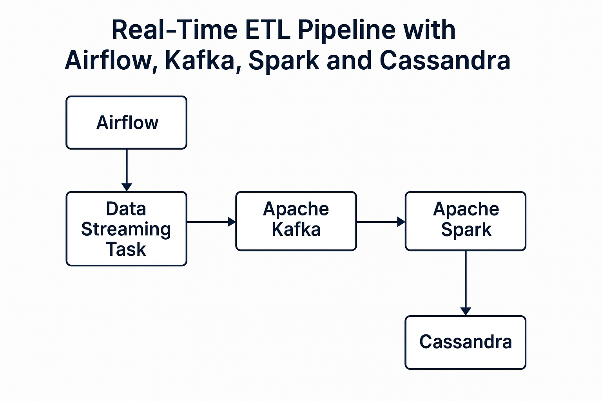

# Real-Time ETL Pipeline with Airflow, Kafka, Spark and Cassandra

**Author**: [Cleber Zumba](https://github.com/cleberzumba)
**Last Updated**: June 18, 2025



This project implements a real-time ETL architecture using the following technologies:

* **Apache Airflow** – for orchestration and workflow scheduling.
* **Apache Kafka** – for real-time data streaming and message queuing.
* **Apache Spark (PySpark)** – for distributed data processing.
* **Apache Cassandra** – a scalable NoSQL database for storing processed data.

---

## 🚀 Architecture Overview

The pipeline operates as follows:

1. **Airflow** triggers the DAG that starts the ingestion process.
2. A Python script simulates data ingestion from an external API and streams it to **Kafka**.
3. **Spark Structured Streaming** reads messages from Kafka, applies transformations, and filters the data.
4. The transformed data is written to **Cassandra** in near real time.
5. All components run in isolated containers orchestrated via **Docker Compose**.

---

## 📦 Technologies

* Python 3.11
* Apache Airflow 2.10.4
* Apache Kafka 3.9.0
* Apache Spark 3.5.4 (PySpark)
* Apache Cassandra 5.0.2
* Docker & Docker Compose

---

## 📁 Project Structure

```
.
├── client/
│   ├── Dockerfile                  # Container image for Spark consumer
│   ├── LEIAME.txt
│   └── consumer_stream.py         # Spark consumer that writes to Cassandra
├── image/
│   └── architecture.jpg           # Architecture diagram
├── server/
│   ├── LEIAME.txt
│   ├── dags/                      # Airflow DAGs
│   ├── docker-compose.yml        # Multi-service container orchestration
│   ├── entrypoint/               # Entrypoint script for Airflow
│   └── requirements.txt          # Python dependencies
└── README.md
```

---

## 🧪 Running the Pipeline

1. Start the services:

```bash
cd server
docker compose up -d --build
```

2. Open the Airflow web interface:

```
http://localhost:8080
```

3. Trigger the DAG named: `real-time-etl-stack`

4. Verify Cassandra for stored results:

```bash
docker exec -it cassandra cqlsh
USE dados_usuarios;
SELECT * FROM tb_usuarios;
```

---

## ✅ Expected Output

User data is ingested, transformed, and stored in the `tb_usuarios` table in Cassandra — all in real time.

---

## 👨‍💻 Author

**Cleber Zumba** – Data Engineer passionate about real-time processing and distributed systems.
